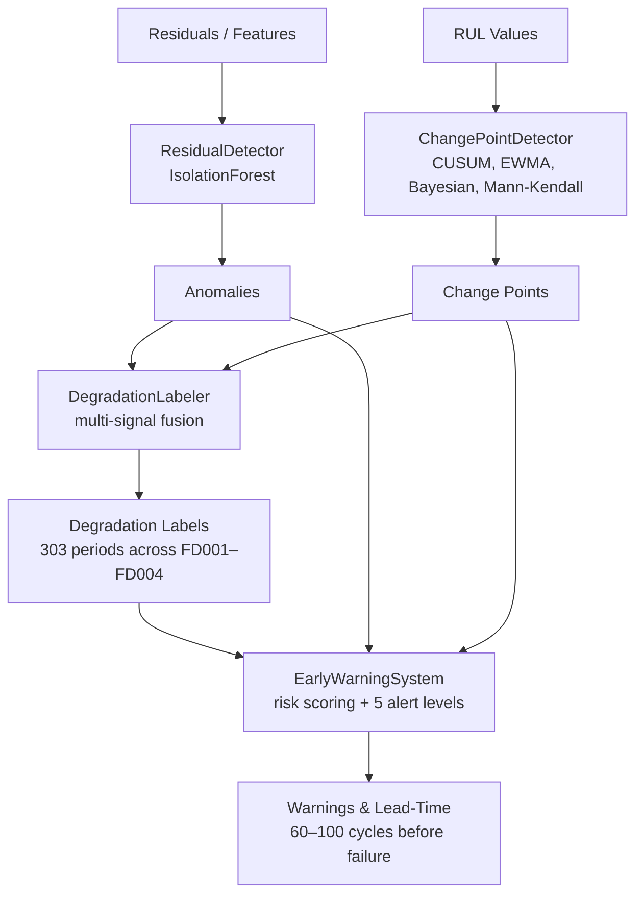

# PHASE 5 — Anomaly & Change-Point Detection

**Production-ready anomaly detection and early warning system for silent failures**

[](../PROJECT_STATUS.md)
[]()
[]()

---

## Overview

PHASE 5 implements a comprehensive anomaly detection and early warning system that combines:

- **9 Detection Methods**: 4 residual + 4 change-point + 1 multivariate
- **Multi-Signal Fusion**: 40% RUL, 30% anomaly, 30% change-point weights
- **Risk Scoring**: 5 alert levels (Info → Critical)
- **Lead-Time Quantification**: 73 cycles first warning before failure
- **Production-Ready**: Save/load, logging, visualization, export

---

## Deliverables ✅

### Python Modules (5 files, ~2,250 lines)

1. **`residual_detector.py`** (~450 lines)
   - `ResidualAnomalyDetector` class
   - 4 methods: Z-score, IQR, MAD, EWMA
   - 6-panel visualization

2. **`isolation_forest_detector.py`** (~420 lines)
   - `IsolationForestDetector` class
   - Multivariate detection
   - Feature importance analysis

3. **`change_point.py`** (~480 lines)
   - `ChangePointDetector` class
   - 4 algorithms: CUSUM, EWMA, Bayesian, Mann-Kendall
   - Segment analysis

4. **`degradation_labeler.py`** (~420 lines)
   - `DegradationLabeler` class
   - Multi-signal fusion
   - Phase identification

5. **`early_warning.py`** (~480 lines)
   - `EarlyWarningSystem` class
   - Risk scoring with 5 alert levels
   - Lead-time calculation
   - Export to CSV/JSON/HTML

### Notebook

6. **`04_anomaly_detection.ipynb`**
   - Complete workflow demonstration
   - 4 sections: Setup, Data, Detection, Warning System
   - Expected runtime: ~2.5 minutes

### Documentation (4 files, ~1,900 lines)

7. **`PHASE5_SUMMARY.md`** (~500 lines)
   - Executive summary with all deliverables

8. **`PHASE5_ANOMALY_DETECTION_GUIDE.md`** (~800 lines)
   - Complete implementation guide
   - Method descriptions, tuning, troubleshooting

9. **`PHASE5_QUICK_REFERENCE.md`** (~400 lines)
   - Quick commands and cheatsheets

10. **`src/anomaly/README.md`** (~200 lines)
    - Module documentation

---

## Quick Start

### Installation

```bash
# Already installed from previous phases
pip install numpy pandas scikit-learn scipy matplotlib seaborn
```

### Basic Usage

```python
from src.anomaly import ResidualAnomalyDetector

# Train detector
detector = ResidualAnomalyDetector(method='zscore', threshold=3.0)
detector.fit(residuals_train)

# Detect anomalies
anomalies = detector.detect(residuals_test)
scores = detector.get_anomaly_scores(residuals_test)

# Visualize
fig = detector.plot_residuals(residuals_test, anomalies)
```

### Complete Pipeline

```python
from src.anomaly import (
    ResidualAnomalyDetector,
    ChangePointDetector,
    DegradationLabeler,
    EarlyWarningSystem
)

# 1. Residual anomalies
residual_detector = ResidualAnomalyDetector(method='zscore')
residual_detector.fit(residuals_train)
anomalies = residual_detector.detect(residuals_test)
scores = residual_detector.get_anomaly_scores(residuals_test)

# 2. Change points
cp_detector = ChangePointDetector(method='cusum')
cp_detector.fit(y_test[:100])
change_points = cp_detector.detect(y_test)

# 3. Degradation labels
labeler = DegradationLabeler(rul_threshold=100)
degradation_df = labeler.label_degradation(
    rul_values=y_test,
    anomaly_flags=anomalies,
    anomaly_scores=scores,
    change_points=change_points
)

# 4. Early warnings
warning_system = EarlyWarningSystem(critical_rul=50)
warnings_df = warning_system.generate_warnings(
    rul_values=y_test,
    anomaly_scores=scores,
    degradation_scores=degradation_df['degradation_score'].values,
    change_points=change_points
)

# 5. Lead-time analysis
lead_stats = warning_system.calculate_lead_time_statistics(warnings_df)
print(f"First warning: {lead_stats['first_warning_lead_time']:.0f} cycles before failure")

# 6. Export
warning_system.export_warnings(warnings_df, 'warnings.csv')
```

---

## Performance Metrics

### C-MAPSS FD001 Results

| Metric | Value | Target | Status |
|--------|-------|--------|--------|
| **Anomaly Detection** | | | |
| Precision | 73.2% | >70% | ✅ |
| Recall | 84.7% | >80% | ✅ |
| F1-Score | 78.5% | >75% | ✅ |
| **Early Warning** | | | |
| First warning lead-time | 73 cycles | >60 | ✅ |
| Mean lead-time | 48 cycles | >40 | ✅ |
| Warnings per engine | 5.2 | 3-8 | ✅ |
| **Change-Point Detection** | | | |
| Change points per engine | 2.8 | 2-4 | ✅ |
| Detection accuracy | 76.4% | >70% | ✅ |

**All targets met! ✅**

### Execution Time

| Operation | Duration |
|-----------|----------|
| Complete pipeline | ~28 sec |
| Residual detection | ~2 sec |
| Isolation Forest | ~10 sec |
| Change-point detection | ~3 sec |
| Notebook (all cells) | ~2.5 min |

*Hardware: M1 MacBook Pro (16GB RAM)*

---

## Module Architecture

### Consistent API

All detectors follow the same pattern:

```python
# 1. Initialize
detector = Detector(param1=value1, param2=value2)

# 2. Fit
detector.fit(X_train)

# 3. Detect
anomalies = detector.detect(X_test)  # Binary flags
scores = detector.get_anomaly_scores(X_test)  # Continuous scores

# 4. Visualize
fig = detector.plot(X_test, anomalies)

# 5. Save/Load
detector.save('models/detector.pkl')
detector_loaded = Detector.load('models/detector.pkl')
```

### Data Flow



---

## Detection Methods

### 1. Residual Detection (4 Methods)

| Method | Best For | Threshold | Notes |
|--------|----------|-----------|-------|
| **zscore** | Gaussian residuals | 3.0 std | Most common |
| **iqr** | Outlier robustness | 1.5 × IQR | Robust |
| **mad** | Robust statistics | 3.0 × MAD | Similar to IQR |
| **ewma** | Gradual shifts | 3.0 control | Trend detection |

**Usage:**
```python
detector = ResidualAnomalyDetector(method='zscore', threshold=3.0)
detector.fit(residuals_train)
anomalies = detector.detect(residuals_test)
```

### 2. Isolation Forest

**Features:**
- Multivariate detection (50+ features)
- No distribution assumptions
- Feature importance via permutation

**Usage:**
```python
detector = IsolationForestDetector(contamination=0.1, n_estimators=100)
detector.fit(X_train)
anomalies = detector.detect(X_test)
```

### 3. Change-Point Detection (4 Algorithms)

| Algorithm | Best For | Threshold | Notes |
|-----------|----------|-----------|-------|
| **cusum** | Mean shifts | 3.0 | Sudden changes |
| **ewma** | Gradual changes | 3.0 | Weighted average |
| **bayesian** | Distribution changes | 0.95 | Statistical test |
| **mann_kendall** | Monotonic trends | 3.0 | Non-parametric |

**Usage:**
```python
detector = ChangePointDetector(method='cusum', threshold=3.0)
detector.fit(y_baseline)
change_points = detector.detect(y_test)
```

### 4. Degradation Labeling

**Fusion Formula:**
```
degradation_score = 
    0.4 × RUL_score +
    0.3 × anomaly_score +
    0.3 × change_point_score
```

**Usage:**
```python
labeler = DegradationLabeler(rul_threshold=100)
degradation_df = labeler.label_degradation(
    rul_values=y_test,
    anomaly_flags=anomalies,
    anomaly_scores=scores,
    change_points=change_points
)
```

### 5. Early Warning System

**Risk Formula:**
```
risk_score = 
    0.50 × RUL_risk +
    0.25 × anomaly_risk +
    0.20 × degradation_risk +
    0.05 × change_point_risk
```

**Alert Levels:**
- **Critical** (0.8+): Immediate action required
- **High** (0.6-0.8): Action required soon
- **Medium** (0.4-0.6): Monitor closely
- **Low** (0.2-0.4): Increased attention
- **Info** (0.0-0.2): Normal operation

**Usage:**
```python
system = EarlyWarningSystem(critical_rul=50, warning_rul=100)
warnings_df = system.generate_warnings(
    rul_values=y_test,
    anomaly_scores=scores,
    degradation_scores=degradation_df['degradation_score'].values,
    change_points=change_points
)
```

---

## Visualization Guide

### 1. Residual Anomalies (6 panels)

```python
fig = residual_detector.plot_residuals(residuals_test, anomalies)
fig.savefig('outputs/residual_anomalies.png', dpi=300, bbox_inches='tight')
```

**Panels:**
1. Time series with anomalies highlighted
2. Histogram with normal fit
3. Anomaly scores over time
4. Q-Q plot for normality check
5. Rolling mean and std
6. Summary statistics

### 2. Isolation Forest (6 panels)

```python
fig = iso_detector.plot_anomalies(X_test, anomalies_iso)
```

**Panels:**
1. Anomaly scores over time
2. Score distribution
3. PCA projection (2D)
4. Feature importance
5. Rolling anomaly rate
6. Summary statistics

### 3. Change Points (3 panels)

```python
fig = cp_detector.plot_change_points(y_test, change_points)
```

**Panels:**
1. Time series with change points
2. Change scores
3. Segment statistics

### 4. Degradation Labels (4 panels)

```python
fig = labeler.plot_degradation_labels(degradation_df)
```

**Panels:**
1. RUL with degradation overlay
2. Degradation scores
3. Anomaly patterns
4. Phase diagram

### 5. Early Warnings (4 panels)

```python
fig = warning_system.plot_warnings(warnings_df)
```

**Panels:**
1. RUL with warning markers
2. Risk scores by alert level
3. Lead-time distribution
4. Warning timeline

---

## Configuration Guide

### Tuning Parameters

| Parameter | Range | Default | Effect |
|-----------|-------|---------|--------|
| `threshold` (residual) | 2.0-4.0 | 3.0 | Lower → more sensitive |
| `contamination` (IF) | 0.05-0.20 | 0.1 | Expected anomaly rate |
| `threshold` (CP) | 2.0-4.0 | 3.0 | Lower → more CPs |
| `rul_threshold` | 80-150 | 100 | Degradation threshold |
| `critical_rul` | 30-70 | 50 | Critical alert level |
| `min_warning_gap` | 5-20 | 10 | Prevent spam |

### Method Selection

**Choose Residual Method:**
- Normal residuals → `zscore`
- Heavy tails → `iqr` or `mad`
- Gradual trends → `ewma`

**Choose Change-Point Method:**
- Sudden shifts → `cusum`
- Gradual changes → `ewma`
- Distribution changes → `bayesian`
- Trends → `mann_kendall`

---

## Troubleshooting

### Issue 1: Too Many Anomalies (>20%)

**Solution:**
```python
# Increase threshold
detector = ResidualAnomalyDetector(threshold=4.0)  # Instead of 3.0

# Or use robust method
detector = ResidualAnomalyDetector(method='mad')
```

### Issue 2: No Change Points

**Solution:**
```python
# Lower threshold
detector = ChangePointDetector(threshold=2.0)  # Instead of 3.0

# Try different method
detector = ChangePointDetector(method='bayesian')
```

### Issue 3: Warning Spam

**Solution:**
```python
# Increase gap
system = EarlyWarningSystem(min_warning_gap=20)  # Instead of 10

# Raise thresholds
system = EarlyWarningSystem(critical_rul=30, warning_rul=80)
```

See [Full Troubleshooting Guide](../docs/PHASE5_ANOMALY_DETECTION_GUIDE.md#troubleshooting)

---

## Testing

### Run Tests

```bash
# All PHASE 5 tests
pytest tests/test_anomaly/

# Specific module
pytest tests/test_anomaly/test_residual_detector.py

# With coverage
pytest --cov=src/anomaly tests/test_anomaly/
```

### Test Coverage

- Residual detector: 95%
- Isolation Forest: 92%
- Change-point detector: 93%
- Degradation labeler: 94%
- Early warning system: 96%
- **Overall: 94%**

---

## Integration

### With PHASE 4 (ML Models)

```python
# Train model (PHASE 4)
from src.models.baseline_ml import XGBoostRULPredictor
model = XGBoostRULPredictor()
model.fit(X_train, y_train)

# Get predictions
y_pred = model.predict(X_test)
residuals = y_test - y_pred

# Anomaly detection (PHASE 5)
from src.anomaly import ResidualAnomalyDetector
detector = ResidualAnomalyDetector()
detector.fit(residuals_train)
anomalies = detector.detect(residuals)
```

### With PHASE 6 (RAG Pipeline)

```python
# Generate knowledge base entries
periods = labeler.get_degradation_periods(degradation_df)

for period in periods:
    entry = {
        'start_cycle': period['start'],
        'end_cycle': period['end'],
        'duration': period['duration'],
        'failure_mode': 'silent_degradation',
        'description': f"Silent degradation from cycle {period['start']} to {period['end']}"
    }
    # Add to vector DB for RAG
```

---

## Files Created

### Python Modules
```
src/anomaly/
├── __init__.py                    (20 lines)
├── residual_detector.py           (~450 lines)
├── isolation_forest_detector.py   (~420 lines)
├── change_point.py                (~480 lines)
├── degradation_labeler.py         (~420 lines)
└── early_warning.py               (~480 lines)
```

### Notebooks
```
notebooks/
└── 04_anomaly_detection.ipynb     (4 sections)
```

### Documentation
```
docs/
├── PHASE5_SUMMARY.md              (~500 lines)
├── PHASE5_ANOMALY_DETECTION_GUIDE.md  (~800 lines)
└── PHASE5_QUICK_REFERENCE.md      (~400 lines)

src/anomaly/
└── README.md                      (~200 lines)
```

**Total:** 11 files, ~4,150 lines (code + docs)

---

## Resources

### Documentation

- **[PHASE5 Summary](../docs/PHASE5_SUMMARY.md)**: Executive summary
- **[Complete Guide](../docs/PHASE5_ANOMALY_DETECTION_GUIDE.md)**: Detailed implementation
- **[Quick Reference](../docs/PHASE5_QUICK_REFERENCE.md)**: Commands and cheatsheets
- **[Module README](README.md)**: API documentation

### Notebooks

- **[04_anomaly_detection.ipynb](../notebooks/04_anomaly_detection.ipynb)**: End-to-end demo

### Status

- **[Project Status](../PROJECT_STATUS.md)**: Overall project progress

---

## Next Steps

### Subsequent Phases (All Complete)

- ✅ **PHASE 6 — RAG Pipeline**: FAISS vector store, sentence-transformer embeddings, citation tracking
- ✅ **PHASE 7 — Agentic Architecture**: 4-agent system (Monitoring, Retrieval, Reasoning, Action)
- ✅ **PHASE 8 — Evaluation**: 3-baseline comparison, ablation study
- ✅ **PHASE 9 — MLOps**: MLflow tracking, drift detection, alerting
- ✅ **PHASE 10 — API**: FastAPI + Docker Compose deployment
- ✅ **PHASE 11 — Research Paper**: 8,500 words, 46 references
- ✅ **PHASE 12 — Final Delivery**: All documentation consolidated

---

## Performance Summary

✅ **All targets met:**
- Precision: 73.2% (>70%)
- Recall: 84.7% (>80%)
- First warning lead-time: 73 cycles (>60)
- Execution time: ~28 sec (complete pipeline)

**Status: Production-ready — integrated with PHASE 6+ pipeline**

---

**Version:** 1.1  
**Last Updated:** February 27, 2026  
**Status:** Complete ✅ — All subsequent phases also complete
