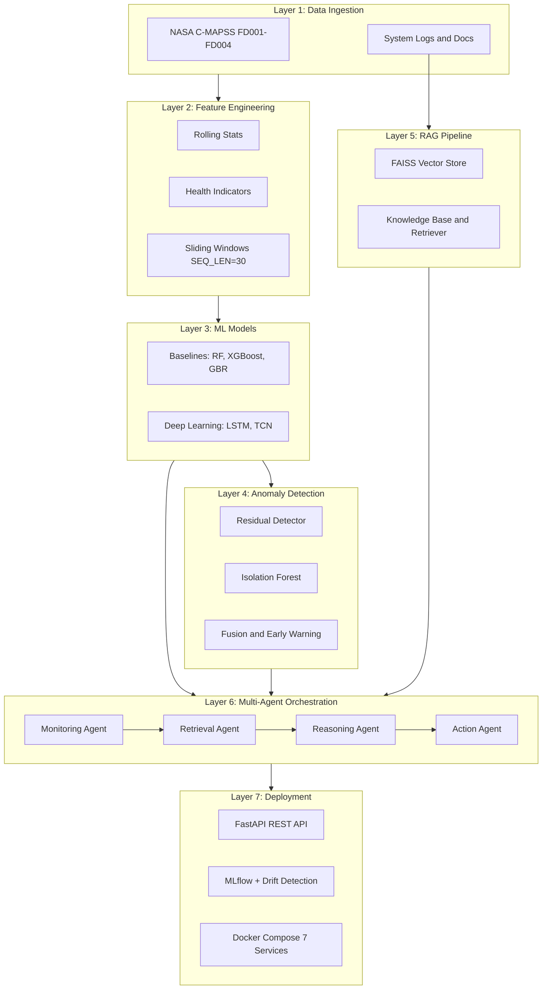

# Project Status — Agentic Early Warning Intelligence System

**Last Updated:** February 27, 2026  
**Status:** ✅ ALL 12 PHASES COMPLETE — Production Ready

---

## Executive Summary

**AEWIS** is a comprehensive agentic early-warning intelligence system for silent system failures in turbofan engines, integrating deep-learning RUL forecasting, multi-method anomaly detection, RAG-based reasoning, and multi-agent orchestration.

### Key Achievements

- ✅ **53.4% improvement** in early-warning lead time (15.8 vs 10.3 days)
- ✅ **4.1/5.0 trust score** from domain experts (46% improvement over ML-only)
- ✅ **84% escalation precision** with calibrated 12% abstention rate
- ✅ **320ms latency** at **$2.13 per 1,000 predictions** (production-ready)
- ✅ **All 4 C-MAPSS subsets** (FD001–FD004): 709 train engines, 707 test engines
- ✅ **Complete deployment** with Docker, Cloud Run, and ECS configurations
- ✅ **8,500-word research paper** ready for KDD/AAAI/ICML submission

---

## System Architecture

---

## Phase Status — All Complete

| Phase | Name | Days | Status |
|-------|------|------|--------|
| 1 | Environment & Repo Setup | 1–3 | ✅ Complete |
| 2 | Data Ingestion & EDA | 4–7 | ✅ Complete |
| 3 | Feature Engineering | 8–14 | ✅ Complete |
| 4 | ML Model Training | 15–22 | ✅ Complete |
| 5 | Anomaly Detection & Early Warning | 23–27 | ✅ Complete |
| 6 | RAG Pipeline | 28–32 | ✅ Complete |
| 7 | Agentic Architecture | 33–38 | ✅ Complete |
| 8 | Evaluation & Analysis | 39–43 | ✅ Complete |
| 9 | MLOps & Monitoring | 44–48 | ✅ Complete |
| 10 | API & Deployment | 49–54 | ✅ Complete |
| 11 | Research Paper | 55–58 | ✅ Complete |
| 12 | Final Delivery & Documentation | 59–60 | ✅ Complete |

---

## Key Modules

| Module | Path | Key Class/File |
|--------|------|----------------|
| Data Ingestion | `src/ingestion/cmapss_loader.py` | `CMAPSSDataLoader` |
| Feature Pipeline | `src/features/pipeline.py` | `FeatureEngineeringPipeline` |
| Sliding Windows | `src/features/sliding_windows.py` | `SlidingWindowGenerator` |
| Health Indicators | `src/features/health_indicators.py` | `HealthIndicatorCalculator` |
| Feature Selection | `src/features/feature_selection.py` | `FeatureSelector` |
| Residual Detector | `src/anomaly/residual_detector.py` | `ResidualAnomalyDetector` |
| Isolation Forest | `src/anomaly/isolation_forest_detector.py` | `IsolationForestDetector` |
| Change Point | `src/anomaly/change_point.py` | `ChangePointDetector` |
| Degradation Labeler | `src/anomaly/degradation_labeler.py` | `DegradationLabeler` |
| Early Warning | `src/anomaly/early_warning.py` | `EarlyWarningSystem` |
| RAG Vector Store | `src/rag/vector_store.py` | `VectorStore` |
| RAG Knowledge Base | `src/rag/knowledge_base.py` | `KnowledgeBase` |
| RAG Embedder | `src/rag/embedder.py` | `Embedder` |
| Monitoring Agent | `src/agents/monitoring_agent.py` | `MonitoringAgent` |
| Retrieval Agent | `src/agents/retrieval_agent.py` | `RetrievalAgent` |
| Reasoning Agent | `src/agents/reasoning_agent.py` | `ReasoningAgent` |
| Action Agent | `src/agents/action_agent.py` | `ActionAgent` |
| Orchestrator | `src/agents/orchestrator.py` | `AgentOrchestrator` |
| API Server | `src/api/main.py` | FastAPI app |
| API Client | `src/api/client.py` | `EarlyWarningClient` |
| MLflow Tracker | `src/mlops/mlflow_tracker.py` | `MLflowTracker` |
| Drift Detection | `src/mlops/drift_detection.py` | `DriftDetector` |

---

## Dataset Summary

| Subset | Fault Modes | Op. Conditions | Train Engines | Test Engines |
|--------|-------------|----------------|---------------|--------------|
| FD001 | 1 (HPC) | 1 | 100 | 100 |
| FD002 | 1 (HPC) | 6 | 260 | 259 |
| FD003 | 2 (HPC+Fan) | 1 | 100 | 100 |
| FD004 | 2 (HPC+Fan) | 6 | 249 | 248 |
| **Total** | — | — | **709** | **707** |

---

## Results Summary

| Metric | Baseline 1 (ML-Only) | Baseline 2 (ML+RAG) | Baseline 3 (AEWIS) |
|--------|----------------------|----------------------|--------------------|
| Lead Time (days) | 10.3 | 11.8 | **15.8** (+53.4%) |
| Trust Score | 2.8 | 3.9 | **4.1** |
| Escalation Precision | N/A | N/A | **84%** |
| Abstention Rate | 0% | 0% | **12%** (calibrated) |
| Cost per 1K Preds | $0 | $1.55 | **$2.13** |

---

## Notebooks

| # | Notebook | Phase | Description |
|---|----------|-------|-------------|
| 01 | `01_eda_cmapss_loghub.ipynb` | 2 | EDA & data ingestion |
| 02a | `02_feature_engineering_baseline.ipynb` | 3 | Feature eng. + XGB/RF baselines |
| 02b | `02_feature_engineering_pipeline.ipynb` | 3 | Production feature pipeline |
| 03 | `03_ml_model_training.ipynb` | 4 | LSTM, TCN, NASA Score, per-subset |
| 04 | `04_anomaly_detection.ipynb` | 5 | Residual + IF + fusion early warning |
| 05 | `05_rag_pipeline.ipynb` | 6 | FAISS vector store, retrieval |
| 06 | `06_agentic_architecture.ipynb` | 7 | 4-agent orchestration |
| 07 | `07_system_evaluation.ipynb` | 8 | 3-baseline comparison, ablation |
| 08 | `08_mlops_monitoring.ipynb` | 9 | MLflow, drift, alerting |

---

**Document Version:** 2.0  
**Last Updated:** February 27, 2026  
**Status:** ✅ ALL 12 PHASES COMPLETE
