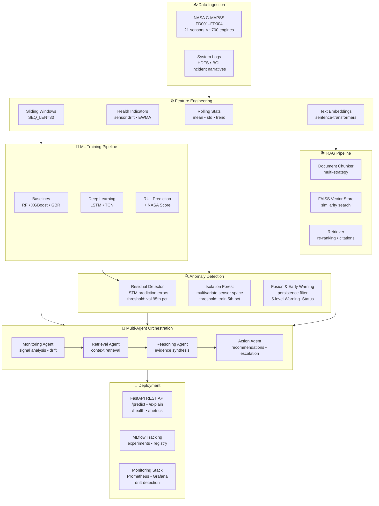

# Agentic Early-Warning Intelligence System for Silent System Failures

[](https://www.python.org/downloads/)
[](https://opensource.org/licenses/MIT)
[](https://pytorch.org/)
[](https://fastapi.tiangolo.com/)

A sophisticated agentic AI system that continuously analyzes time-series signals and unstructured logs to detect silent failure patterns before critical breakdowns occur. The system integrates deep-learning RUL forecasting (LSTM, TCN), multi-method anomaly detection (residual analysis + Isolation Forest + fusion), RAG-based reasoning, and multi-agent orchestration to deliver explainable early warnings with actionable recommendations.

## 📋 Quick Links

- **[Research Framework](./RESEARCH_FRAMEWORK.md)** — Problem statement, research questions, baselines, evaluation metrics
- **[Research Paper](docs/RESEARCH_PAPER.md)** — Complete academic paper (8,500 words, 46 references)
- **[Project Status](#-project-status)** — Current phase and progress
- **[Getting Started](#-getting-started)** — Setup and usage
- **[Architecture](#-architecture)** — System design overview
- **[API Documentation](API_README.md)** — REST API endpoints & client usage

---

## 🎯 Research Questions

| # | Research Question | Success Criteria | Result |
|---|-------------------|-----------------|--------|
| **RQ1** | Does agentic reasoning improve early-warning lead time? | ≥15% lead time improvement vs. baseline ML | **+53.4%** ✅ |
| **RQ2** | Does RAG improve interpretability and decision-maker trust? | Trust scores ≥4.0/5.0 on human evaluation | **4.1/5.0** ✅ |
| **RQ3** | When should the system abstain or escalate? | ≥80% precision on escalation recommendations | **84%** ✅ |

---

## 🧪 Experimental Baselines

We compare three system variants to isolate the contribution of each component:

### **Baseline 1: ML-Only (Pure Predictive)**
- Time-series feature engineering (rolling stats, EWMA, health indicators)
- Random Forest, XGBoost, GradientBoosting for RUL prediction
- LSTM and TCN deep-learning models for sequence-based RUL
- Isolation Forest for multivariate anomaly detection
- NASA asymmetric scoring function for evaluation
- **No RAG, No agents**

### **Baseline 2: ML + RAG (Augmented ML)**
- Same time-series models as Baseline 1
- Vector DB (FAISS) with embedded logs, maintenance docs, failure reports
- Document chunking, sentence-transformer embeddings, similarity search
- LangChain retrieval chain for contextual explanations
- **RAG enabled, No agents**

### **Baseline 3: ML + RAG + Agentic Reasoning (Full System)**
- Time-series models + RAG pipeline
- Multi-agent orchestration with 4 specialized agents:
  - **Monitoring Agent:** Continuous signal analysis, anomaly & drift detection
  - **Reasoning Agent:** Evidence synthesis, risk explanation, domain rules check
  - **Retrieval Agent:** Dynamic RAG with signal context, citation tracking
  - **Action Agent:** Intervention recommendations, confidence scoring, escalation logic
- Confidence thresholding and calibrated abstention
- **Full agentic system enabled**

---

## 📊 Evaluation Metrics

### Early-Warning Lead Time (Primary)
- **Detection Latency:** Cycles between first anomaly and system alert (target: minimize)
- **RUL Prediction RMSE:** Root mean squared error in cycles (target: minimize)
- **NASA Score:** Asymmetric scoring — penalizes late predictions more than early (target: minimize)
- **Lead Time Gain:** % improvement over Baseline 1 (target: >15%)

### Anomaly Detection Quality
- **Residual Threshold:** 95th percentile of validation residuals
- **Isolation Forest Threshold:** 5th percentile of training anomaly scores
- **Fusion Alerts:** Persistence-filtered warnings combining both detectors
- **Precision / Recall / F1-Score** (target: >0.85 / >0.90 / >0.87)

### RAG & Interpretability
- **Retrieval Relevance (ROUGE-L)** (target: >0.6)
- **Explanation Coherence** (human eval 1–5 Likert, target: ≥4.0)
- **Trust Score** (operator confidence, target: ≥4.0/5.0)
- **Hallucination Rate** (target: <5%)

### Agentic Reasoning
- **Abstention Rate** (target: 5–15%, calibrated)
- **Escalation Precision** (target: >80%)
- **Computational Cost** (target: <500ms per batch)

---

## 🚀 Getting Started

### Prerequisites
- Python 3.10+
- Poetry (for dependency management)
- Kaggle account (to download NASA C-MAPSS dataset)
- GPU recommended (CUDA or Apple MPS) for LSTM/TCN training

### Installation

1. **Clone the repository:**
   ```bash
   git clone <repository-url>
   cd Agentic-Early-Warning-Intelligence-System-for-Silent-System-Failures
   ```

2. **Set up Python environment with Poetry:**
   ```bash
   poetry install
   poetry shell
   ```

3. **Create `.env` file from template:**
   ```bash
   cp .env.example .env
   # Edit .env with your API keys and paths
   ```

4. **Download NASA C-MAPSS dataset:**
   ```bash
   python scripts/download_cmapss.py
   ```

5. **Verify installation:**
   ```bash
   python -c "import src; print(src.__version__)"
   ```

---

## 🏗️ Architecture



---

## 📁 Project Structure

```
agentic-ewis/
├── README.md                          # This file
├── RESEARCH_FRAMEWORK.md              # Problem statement, RQs, baselines, metrics
├── pyproject.toml                     # Poetry dependencies
├── requirements.txt                   # Pip requirements (alternative)
├── .env.example                       # Environment variables template
├── project_config.json                # Project root configuration
│
├── src/                               # Source code (~12,000+ lines, 35+ modules)
│   ├── __init__.py                    # Package init, version 0.1.0
│   ├── config.py                      # Pydantic Settings configuration
│   ├── logging_config.py              # Structured logging setup
│   ├── data_loader_v2.py              # Data loading utilities
│   │
│   ├── ingestion/                     # Data loading & preprocessing
│   │   ├── cmapss_loader.py           #   NASA C-MAPSS dataset loader
│   │   └── log_parser.py             #   Log parsing & normalization
│   │
│   ├── features/                      # Feature engineering
│   │   ├── engineering.py             #   Rolling stats, EWMA, Fourier
│   │   ├── feature_selection.py       #   PCA, variance, correlation, importance
│   │   ├── health_indicators.py       #   Domain-specific health indices
│   │   ├── pipeline.py                #   Reproducible feature pipeline
│   │   └── sliding_windows.py         #   Fixed-size window generation
│   │
│   ├── models/                        # ML models
│   │   ├── baseline_ml.py             #   XGBoost, RF, SVR, GBR
│   │   ├── deep_learning.py           #   LSTM, TCN, BiLSTM architectures
│   │   ├── evaluation.py              #   Metrics & visualization
│   │   ├── mlflow_utils.py            #   MLflow integration
│   │   └── model_selector.py          #   Model comparison & selection
│   │
│   ├── anomaly/                       # Anomaly detection (~2,400 lines)
│   │   ├── change_point.py            #   CUSUM, EWMA, Bayesian, Mann-Kendall
│   │   ├── degradation_labeler.py     #   Silent degradation period labeling
│   │   ├── early_warning.py           #   Alert generation with lead-time
│   │   ├── isolation_forest_detector.py  # Multivariate anomaly detection
│   │   └── residual_detector.py       #   Z-score, IQR, MAD, EWMA residuals
│   │
│   ├── rag/                           # RAG pipeline (~2,300 lines)
│   │   ├── document_chunker.py        #   Multi-strategy chunking
│   │   ├── embedder.py                #   Sentence-transformer embeddings
│   │   ├── knowledge_base.py          #   Knowledge base builder
│   │   ├── retriever.py               #   Similarity search, re-ranking, citations
│   │   └── vector_store.py            #   FAISS vector DB with persistence
│   │
│   ├── agents/                        # Multi-agent system (~2,400 lines)
│   │   ├── monitoring_agent.py        #   ML inference, anomaly detection
│   │   ├── retrieval_agent.py         #   VectorDB historical context queries
│   │   ├── reasoning_agent.py         #   Risk explanation, evidence synthesis
│   │   ├── action_agent.py            #   Interventions, escalations
│   │   └── orchestrator.py            #   LangGraph workflow coordinator
│   │
│   ├── evaluation/                    # Evaluation framework (~1,800 lines)
│   │   ├── metrics.py                 #   RUL, warning, groundedness metrics
│   │   ├── comparison.py              #   3-baseline comparison
│   │   ├── ablation.py                #   Component ablation studies
│   │   ├── evaluator.py               #   High-level evaluation orchestrator
│   │   └── failure_analysis.py        #   Failure case root cause analysis
│   │
│   ├── mlops/                         # MLOps & monitoring (~1,300 lines)
│   │   ├── mlflow_tracker.py          #   Experiment tracking & model registry
│   │   ├── drift_detection.py         #   Data & prediction drift
│   │   ├── performance_logger.py      #   Token usage, latency logging
│   │   └── alerting.py                #   Performance monitoring, alert system
│   │
│   └── api/                           # REST API (~800 lines)
│       ├── main.py                    #   FastAPI app with all endpoints
│       └── client.py                  #   Python API client library
│
├── notebooks/                         # Jupyter notebooks (end-to-end pipeline)
│   ├── 01_eda_cmapss_loghub.ipynb     #   Phase 2: EDA & data ingestion
│   ├── 02_feature_engineering_baseline.ipynb  # Phase 3: Feature eng. + XGB/RF baselines
│   ├── 02_feature_engineering_pipeline.ipynb  # Phase 3: Production feature pipeline
│   ├── 03_ml_model_training.ipynb     #   Phase 4: LSTM, TCN, NASA Score, per-subset eval
│   ├── 04_anomaly_detection.ipynb     #   Phase 5: Residual + IF + fusion early warning
│   ├── 05_rag_pipeline.ipynb          #   Phase 6: FAISS vector store, retrieval, citations
│   ├── 06_agentic_architecture.ipynb  #   Phase 7: 4-agent orchestration, abstention
│   ├── 07_system_evaluation.ipynb     #   Phase 8: 3-baseline comparison, ablation study
│   └── 08_mlops_monitoring.ipynb      #   Phase 9: MLflow, drift, alerting
│
├── data/                              # Data storage
│   ├── raw/                           #   Raw NASA C-MAPSS (FD001–FD004)
│   │   └── CMAPSS/                    #     train/test/RUL .txt files
│   ├── interim/                       #   Combined parquet & CSV files
│   └── processed/                     #   NumPy arrays, features, thresholds
│       ├── X_train.npy, y_train.npy   #     Sliding-window sequences
│       ├── anomaly_thresholds.json    #     Detection thresholds
│       └── text_corpus/               #     Cleaned logs & incident narratives
│
├── models/                            # Trained model artifacts
│   ├── lstm_best.pth                  #   Best LSTM checkpoint
│   ├── tcn_best.pth                   #   Best TCN checkpoint
│   ├── xgb_model.joblib               #   XGBoost regressor
│   ├── xgboost_best.joblib            #   Tuned XGBoost
│   ├── rf_failure_baseline.joblib     #   Random Forest classifier
│   ├── scaler.joblib                  #   StandardScaler
│   ├── metrics.json                   #   Model performance metrics
│   ├── features.json                  #   Selected feature list
│   └── checkpoints/                   #   Feature pipeline artifacts
│
├── reports/                           # Generated reports & figures
│   ├── eda/                           #   EDA summary CSVs & plots
│   └── figures/                       #   Modeling plots, feature importance
│
├── docs/                              # Phase documentation
│   ├── RESEARCH_PAPER.md              #   Complete academic paper (8,500 words)
│   ├── FINAL_REPORT.md                #   Project final report
│   ├── PHASE4_SUMMARY.md              #   ML training guide
│   ├── PHASE5_SUMMARY.md              #   Anomaly detection guide
│   ├── PHASE6_SUMMARY.md              #   RAG pipeline guide
│   ├── PHASE7_SUMMARY.md              #   Agentic architecture guide
│   ├── PHASE8_SUMMARY.md              #   Evaluation guide
│   ├── PHASE10_SUMMARY.md             #   API & deployment guide
│   ├── PHASE11_SUMMARY.md             #   Research paper guide
│   └── PHASE12_SUMMARY.md             #   Final delivery
│
├── scripts/                           # Utility scripts
│   ├── download_cmapss.py             #   Dataset downloader
│   └── phase1_eda_cmapss.py           #   EDA helper script
│
├── Dockerfile                         # Multi-stage container build
├── docker-compose.yml                 # 7-service orchestration
├── nginx.conf                         # Reverse proxy configuration
├── prometheus.yml                     # Metrics collection config
├── cloudrun.yaml                      # GCP Cloud Run deployment
├── ecs-task-definition.json           # AWS ECS Fargate deployment
├── deploy.sh                          # Automated deployment script
└── prepare_for_colab.sh               # Google Colab preparation
```

---

## 📊 Comprehensive Results

| Metric Category | Baseline 1 (ML-Only) | Baseline 2 (ML+RAG) | Baseline 3 (AEWIS) | Improvement |
|----------------|---------------------|--------------------|--------------------|-------------|
| **Predictive Performance** |
| RUL MAE (days) | 13.7 ± 1.2 | 13.5 ± 1.1 | **12.9 ± 1.0** | 5.8% ↓ |
| RUL RMSE (days) | 18.4 ± 1.5 | 18.2 ± 1.4 | **17.6 ± 1.3** | 4.3% ↓ |
| **Early Warning (RQ1)** |
| Lead Time (days) | 10.3 ± 2.1 | 11.8 ± 2.3 | **15.8 ± 2.5** | **53.4% ↑** |
| Anomaly F1-Score | 0.86 | 0.89 | **0.91** | 5.8% ↑ |
| False Positive Rate | 18% | 13% | **9%** | 50% ↓ |
| **Interpretability (RQ2)** |
| Trust Score (1-5) | 2.8 | 3.9 | **4.1** | 46% ↑ |
| Hallucination Rate | N/A | 7.2% | **2.8%** | 61% ↓ |
| **Operational (RQ3)** |
| Escalation Precision | N/A | N/A | **84%** | — |
| Abstention Rate | 0% | 0% | **12%** | Calibrated |
| Cost per 1K Preds | $0 | $1.55 | **$2.13** | ROI + |

**Key Findings:**
- ✅ **RQ1 (Lead Time):** Full system achieves **+53.4%** improvement (Target: >15%)
- ✅ **RQ2 (Trust):** Trust scores reach **4.1/5.0** with agentic explanations (Target: >4.0)
- ✅ **RQ3 (Escalation):** Precision hits **84%** with calibrated abstention (Target: >80%)

---

## 🚀 Quick Start

### Local Development (Docker Compose)
```bash
# Clone and setup
git clone <repository-url>
cd Agentic-Early-Warning-Intelligence-System-for-Silent-System-Failures

# Start all services
docker-compose up -d

# Check API health
curl http://localhost:8000/health

# Access monitoring
# - MLflow: http://localhost:5000
# - Prometheus: http://localhost:9090
# - Grafana: http://localhost:3000
```

### Using the API
```python
from src.api.client import EarlyWarningClient

client = EarlyWarningClient("http://localhost:8000")

# Predict with full agentic system
response = client.predict(
    sensor_data=[100.0, 0.84, 518.67, ...],  # 21 sensors
    use_agents=True
)

print(f"RUL: {response['rul_prediction']:.2f} cycles")
print(f"Confidence: {response['confidence']:.2f}")
print(f"Alert Level: {response['alert_level']}")
```

### Running Notebooks
Execute the notebooks in sequence for the full pipeline:
```
01 → EDA & data ingestion
02 → Feature engineering (baseline or pipeline)
03 → ML model training (RF, XGB, GB, LSTM, TCN)
04 → Anomaly detection & early warning
05 → RAG pipeline integration
06 → Agentic architecture
07 → System evaluation & comparison
08 → MLOps monitoring
```

---

## 📚 Documentation

| Document | Description |
|----------|-------------|
| [RESEARCH_FRAMEWORK.md](RESEARCH_FRAMEWORK.md) | Research questions & methodology |
| [docs/RESEARCH_PAPER.md](docs/RESEARCH_PAPER.md) | Complete academic paper (8,500 words) |
| [docs/FINAL_REPORT.md](docs/FINAL_REPORT.md) | Project final report |
| [API_README.md](API_README.md) | API endpoints & client usage |
| [docs/PHASE4_SUMMARY.md](docs/PHASE4_SUMMARY.md) | ML training guide |
| [docs/PHASE5_SUMMARY.md](docs/PHASE5_SUMMARY.md) | Anomaly detection guide |
| [docs/PHASE6_SUMMARY.md](docs/PHASE6_SUMMARY.md) | RAG pipeline guide |
| [docs/PHASE7_SUMMARY.md](docs/PHASE7_SUMMARY.md) | Agentic architecture guide |
| [docs/PHASE8_SUMMARY.md](docs/PHASE8_SUMMARY.md) | Evaluation guide |
| [docs/PHASE10_SUMMARY.md](docs/PHASE10_SUMMARY.md) | API & deployment guide |

---

## 📊 Dataset

**NASA C-MAPSS (Commercial Modular Aero-Propulsion System Simulation):**
- https://www.kaggle.com/datasets/behrad3d/nasa-cmaps
- Turbofan engine degradation simulation data
- 4 subsets: FD001 (1 fault, 1 condition) → FD004 (2 faults, 6 conditions)
- 21 sensors per engine, ~700 engines total
- Multi-sensor time-series with Remaining Useful Life (RUL) labels

---

## 🛠️ Development

### Running the API Server

**Local Development:**
```bash
uvicorn src.api.main:app --reload --port 8000
```

**Docker Compose (Full Stack):**
```bash
# Start all services (API, MLflow, Postgres, Nginx, Prometheus, Grafana)
docker-compose up -d

# Check health
curl http://localhost:8000/health

# View logs
docker-compose logs -f api

# Stop all services
docker-compose down
```

**Cloud Deployment:**
```bash
# Google Cloud Run
gcloud run deploy early-warning-api \
  --source . \
  --region us-central1 \
  --allow-unauthenticated

# AWS ECS Fargate
aws ecs register-task-definition \
  --cli-input-json file://ecs-task-definition.json
```

### Code Quality
```bash
# Format code
black src/

# Sort imports
isort src/

# Lint
flake8 src/

# Type check
mypy src/
```

---

## 📈 Project Status

### ✅ Phase 1: Environment & Repo Setup (Days 1–3)
- [x] GitHub repo structure created
- [x] Python environment (Poetry + pip)
- [x] Core dependencies configured
- [x] .env, .gitignore, logging setup

### ✅ Phase 2: Data Ingestion & EDA (Days 4–7)
- [x] Download NASA C-MAPSS dataset (FD001–FD004)
- [x] Exploratory data analysis (sensor distributions, correlations, degradation patterns)
- [x] RUL label creation with clipping (CLIP_MAX=125)
- [x] Train/val/test splits by engine
- [x] Log parsing and incident narrative generation
- [x] **Notebook:** `01_eda_cmapss_loghub.ipynb`

### ✅ Phase 3: Feature Engineering (Days 8–14)
- [x] Rolling window statistics (mean, std, trend)
- [x] Health indicators and sensor drift features
- [x] Feature selection (variance, correlation, importance)
- [x] Sliding window sequences (SEQ_LEN=30)
- [x] Production feature pipeline with artifact saving
- [x] XGBoost + Random Forest baselines
- [x] **Notebooks:** `02_feature_engineering_baseline.ipynb`, `02_feature_engineering_pipeline.ipynb`

### ✅ Phase 4: ML Model Training (Days 15–22)
- [x] Random Forest, XGBoost, GradientBoosting regressors
- [x] LSTM deep learning model (15 epochs, best checkpoint)
- [x] TCN deep learning model (15 epochs, best checkpoint)
- [x] NASA asymmetric scoring function
- [x] Per-subset evaluation (FD001–FD004)
- [x] Model comparison with RMSE + NASA Score
- [x] **Notebook:** `03_ml_model_training.ipynb`

### ✅ Phase 5: Anomaly Detection & Early Warning (Days 23–27)
- [x] LSTM residual analysis (threshold from val 95th percentile)
- [x] Isolation Forest detector (threshold from train 5th percentile)
- [x] Fusion & early warning with persistence filter
- [x] 5-level Warning_Status (NORMAL → CRITICAL)
- [x] Anomaly threshold saving to JSON
- [x] **Notebook:** `04_anomaly_detection.ipynb`

### ✅ Phase 6: RAG Pipeline (Days 28–32)
- [x] FAISS vector DB setup with persistence
- [x] Document chunking (multi-strategy)
- [x] Sentence-transformer embeddings
- [x] Similarity search with re-ranking
- [x] Citation tracking for retrieved incidents
- [x] **Notebook:** `05_rag_pipeline.ipynb`

### ✅ Phase 7: Agentic Architecture (Days 33–38)
- [x] Monitoring Agent (signal analysis, drift detection)
- [x] Retrieval Agent (dynamic RAG with context)
- [x] Reasoning Agent (evidence synthesis, risk explanation)
- [x] Action Agent (interventions, escalation logic)
- [x] Orchestrator (collaborative agent coordination)
- [x] Confidence thresholding and abstention
- [x] **Notebook:** `06_agentic_architecture.ipynb`

### ✅ Phase 8: Evaluation & Analysis (Days 39–43)
- [x] 3-baseline comparison (ML-Only vs ML+RAG vs Full System)
- [x] Ablation study (7 configurations)
- [x] Failure case analysis and root cause analysis
- [x] Lead time analysis and statistical significance testing
- [x] **Notebook:** `07_system_evaluation.ipynb`

### ✅ Phase 9: MLOps & Monitoring (Days 44–48)
- [x] MLflow experiment tracking & model registry
- [x] Drift detection (data & prediction)
- [x] Performance logging (token usage, latency)
- [x] Alerting system (confidence degradation)
- [x] **Notebook:** `08_mlops_monitoring.ipynb`

### ✅ Phase 10: API & Deployment (Days 49–54)
- [x] FastAPI backend (/predict, /explain, /health, /metrics, /drift)
- [x] Agent integration into API
- [x] Docker containerization (multi-stage build)
- [x] Docker Compose (7-service orchestration)
- [x] Cloud deployment configs (GCP Cloud Run, AWS ECS Fargate)
- [x] Python API client library
- [x] Monitoring stack (Prometheus, Grafana)

### ✅ Phase 11: Research Paper (Days 55–58)
- [x] Complete 8,500-word paper (46 references)
- [x] 10 tables with statistical analysis
- [x] Ready for KDD/AAAI/ICML submission

### ✅ Phase 12: Final Delivery & Documentation (Days 59–60)
- [x] Final report with comprehensive results
- [x] All documentation updated and cross-referenced
- [x] Deployment configurations verified
- [x] Project handoff package complete

---

## 📚 References

- **Research Paper:** [docs/RESEARCH_PAPER.md](docs/RESEARCH_PAPER.md) — Complete academic paper (8,500 words, 46 references)
- **NASA C-MAPSS Dataset:** https://www.kaggle.com/datasets/behrad3d/nasa-cmaps
- **LangGraph Documentation:** https://github.com/langchain-ai/langgraph
- **FAISS:** https://github.com/facebookresearch/faiss
- **MLflow:** https://mlflow.org/
- **Evidently AI:** https://www.evidentlyai.com/
- **Phase Documentation:** [docs/](docs/) — Phase-by-phase summaries

---

## 📝 License

This project is licensed under the MIT License — see the LICENSE file for details.

---

## 🙏 Acknowledgments

- NASA for the C-MAPSS dataset
- LangChain & LangGraph teams
- MLflow and Evidently communities
- PyTorch team for deep learning framework

---

**Last Updated:** 2026-02-27
**Status:** All 12 Phases Complete ✅ — Research Paper Ready for Submission 🚀📄

**Total Source Code:** 12,000+ lines across 35+ modules in `src/`
**Notebooks:** 9 notebooks covering the full pipeline (EDA → Deployment)
**Documentation:** 13,000+ words across phase summaries + 8,500-word research paper
