```mermaid
flowchart TD
    A["Input (batch, features)"] --> B["LSTM Layers (num_layers)"]
    B --> C["Fully Connected (hidden_size)"]
    C --> D["ReLU Activation"]
    D --> E["Dropout"]
    E --> F["Output (1) — RUL prediction"]
```

```mermaid
flowchart TD
    A["Input (batch, features)"] --> B["Multiple TCN Blocks\ndilated convolutions"]
    B --> C["Adaptive Average Pooling"]
    C --> D["Fully Connected"]
    D --> E["ReLU + Dropout"]
    E --> F["Output (1) — RUL prediction"]
```

# PHASE 4 — ML Model Training Guide

## Overview

This guide covers the complete machine learning model training infrastructure for RUL (Remaining Useful Life) prediction in the Agentic Early Warning System. PHASE 4 implements both baseline and advanced models with comprehensive evaluation, MLflow tracking, and automated model selection.

**Timeline:** Days 12-17  
**Status:** ✅ Complete  
**Dependencies:** PHASE 1 (Data Ingestion), PHASE 2 (Logging), PHASE 3 (Feature Engineering)

---

## 📋 Table of Contents

1. [Architecture Overview](#architecture-overview)
2. [Baseline Models](#baseline-models)
3. [Advanced Models](#advanced-models)
4. [Evaluation Framework](#evaluation-framework)
5. [MLflow Integration](#mlflow-integration)
6. [Model Selection](#model-selection)
7. [Usage Examples](#usage-examples)
8. [Hyperparameter Tuning](#hyperparameter-tuning)
9. [Troubleshooting](#troubleshooting)

---

## Architecture Overview

### Module Structure

```
src/models/
├── __init__.py              # Package initialization
├── baseline_ml.py           # XGBoost, Random Forest, Gradient Boosting
├── deep_learning.py         # LSTM, TCN architectures
├── evaluation.py            # Metrics and visualization
├── mlflow_utils.py          # Experiment tracking
└── model_selector.py        # Model comparison and selection
```

### Design Principles

1. **Consistent API:** All models implement the same interface (`fit`, `predict`, `evaluate`)
2. **Framework Agnostic:** Supports scikit-learn and PyTorch models
3. **Production Ready:** Includes save/load, error handling, logging
4. **Comprehensive Evaluation:** 9 metrics + 6-panel visualizations
5. **Automated Selection:** Weighted scoring based on performance + stability

---

## Baseline Models

### XGBoost RUL Predictor

**Best for:** Tabular data, feature importance analysis, fast inference

```python
from src.models.baseline_ml import XGBoostRULPredictor

model = XGBoostRULPredictor(
    n_estimators=200,
    max_depth=6,
    learning_rate=0.1,
    subsample=0.8,
    colsample_bytree=0.8,
    random_state=42
)

# Training with early stopping
model.fit(
    X_train, y_train,
    X_val, y_val,
    early_stopping_rounds=20
)

# Evaluation
metrics = model.evaluate(X_test, y_test)
# Returns: {'rmse': 25.3, 'mae': 18.7, 'r2': 0.85, 'mape': 12.4}

# Feature importance
importance = model.get_feature_importance()

# Save/load
model.save_model('models/xgboost_rul.json')
model.load_model('models/xgboost_rul.json')
```

**Key Parameters:**

- `n_estimators`: Number of boosting rounds (default: 200)
- `max_depth`: Maximum tree depth (default: 6)
- `learning_rate`: Step size shrinkage (default: 0.1)
- `subsample`: Row sampling ratio (default: 0.8)
- `colsample_bytree`: Column sampling ratio (default: 0.8)
- `early_stopping_rounds`: Stop if no improvement (default: 20)

**When to Use:**
- Need interpretability via feature importance
- Large tabular datasets
- Fast training and inference required
- Strong baseline performance needed

### Random Forest RUL Predictor

**Best for:** Robust predictions, reduced overfitting, parallel training

```python
from src.models.baseline_ml import RandomForestRULPredictor

model = RandomForestRULPredictor(
    n_estimators=200,
    max_depth=20,
    min_samples_split=5,
    random_state=42
)

model.fit(X_train, y_train)
metrics = model.evaluate(X_test, y_test)
```

**When to Use:**
- Need ensemble averaging for stability
- Outlier robustness important
- Non-linear relationships

### Gradient Boosting RUL Predictor

**Best for:** High accuracy, sequential boosting

```python
from src.models.baseline_ml import GradientBoostingRULPredictor

model = GradientBoostingRULPredictor(
    n_estimators=200,
    learning_rate=0.1,
    max_depth=5,
    random_state=42
)

model.fit(X_train, y_train)
metrics = model.evaluate(X_test, y_test)
```

**When to Use:**
- Need sklearn-compatible model
- Strong performance without XGBoost dependency
- Sequential boosting advantages

---

## Advanced Models

### LSTM RUL Predictor

**Best for:** Sequential/time-series data, capturing temporal dependencies

```python
from src.models.deep_learning import LSTMRULPredictor, DeepLearningTrainer

# Model
model = LSTMRULPredictor(
    input_size=50,           # Number of features
    hidden_size=64,          # LSTM hidden units
    num_layers=2,            # Stacked LSTM layers
    dropout=0.2,             # Dropout rate
    bidirectional=False      # Bidirectional LSTM
)

# Trainer
trainer = DeepLearningTrainer(
    model=model,
    learning_rate=0.001,
    device='cuda'  # or 'cpu'
)

# Training
history = trainer.train(
    X_train, y_train,
    X_val, y_val,
    epochs=100,
    batch_size=128,
    early_stopping_patience=15
)

# Evaluation
metrics = trainer.evaluate(X_test, y_test)

# Predictions
y_pred = trainer.predict(X_test)

# Save/load
trainer.save_model('models/lstm_rul.pt')
trainer.load_model('models/lstm_rul.pt')
```

**Architecture:**


**Key Parameters:**

- `input_size`: Number of input features (required)
- `hidden_size`: LSTM hidden state size (default: 64)
- `num_layers`: Number of stacked LSTM layers (default: 2)
- `dropout`: Dropout probability (default: 0.2)
- `bidirectional`: Use bidirectional LSTM (default: False)

**When to Use:**
- Sequential sensor data available
- Temporal patterns important
- Need to capture long-term dependencies
- GPU available for training

### TCN RUL Predictor

**Best for:** Temporal patterns, parallel training, long sequences

```python
from src.models.deep_learning import TCNRULPredictor, DeepLearningTrainer

# Model
model = TCNRULPredictor(
    input_size=50,
    num_channels=[64, 64, 64],  # Channel sizes for TCN blocks
    kernel_size=3,               # Convolution kernel size
    dropout=0.2
)

# Same trainer as LSTM
trainer = DeepLearningTrainer(model=model, learning_rate=0.001)
history = trainer.train(X_train, y_train, X_val, y_val, epochs=100)
```

**Architecture:**


**Key Parameters:**

- `input_size`: Number of input features
- `num_channels`: List of channel sizes (default: [64, 64, 64])
- `kernel_size`: Convolution kernel (default: 3)
- `dropout`: Dropout rate (default: 0.2)

**When to Use:**
- Faster training than LSTM (parallel convolutions)
- Very long sequences
- GPU available
- Need flexible receptive field

---

## Evaluation Framework

### RUL Evaluator

Comprehensive evaluation with 9 metrics and 6-panel visualizations.

```python
from src.models.evaluation import RULEvaluator

evaluator = RULEvaluator(model_name="XGBoost")

# Calculate all metrics
metrics = evaluator.calculate_metrics(y_true, y_pred, prefix='test_')
```

### Available Metrics

| Metric | Description | Interpretation |
|--------|-------------|----------------|
| **RMSE** | Root Mean Squared Error | Lower is better; penalizes large errors |
| **MAE** | Mean Absolute Error | Lower is better; average error magnitude |
| **R²** | Coefficient of Determination | Higher is better; 1.0 = perfect fit |
| **MAPE** | Mean Absolute Percentage Error | Lower is better; percentage error |
| **Max Error** | Maximum absolute error | Lower is better; worst-case error |
| **Median Error** | Median absolute error | Robust to outliers |
| **Std Error** | Standard deviation of errors | Lower is better; consistency |
| **Early Prediction %** | Percentage of underestimates | Balance with late predictions |
| **Late Prediction %** | Percentage of overestimates | Balance with early predictions |

### Visualization

```python
# 6-panel comprehensive plot
fig = evaluator.plot_predictions(
    y_true, y_pred,
    title="Model: Predicted vs Actual RUL",
    save_path="outputs/predictions.png"
)
```

**Panels:**
1. **Scatter Plot:** Predicted vs Actual with perfect prediction line
2. **Residuals:** Residuals vs Predicted values
3. **Histogram:** Distribution of residuals
4. **Time Series:** First 500 samples comparison
5. **Error by RUL Range:** Binned error distribution
6. **Metrics Summary:** Text box with all metrics

### Training History

```python
# For deep learning models
fig = evaluator.plot_training_history(
    train_losses=history['train_losses'],
    val_losses=history['val_losses']
)
```

### Model Comparison

```python
# Compare multiple models
models_results = {
    'XGBoost': {'rmse': 25.3, 'mae': 18.7, 'r2': 0.85},
    'LSTM': {'rmse': 28.1, 'mae': 20.2, 'r2': 0.82}
}

comparison_df = evaluator.create_comparison_table(models_results)
fig = evaluator.plot_model_comparison(comparison_df, metrics=['rmse', 'mae', 'r2'])
```

---

## MLflow Integration

### MLflow Tracker

Automatic experiment tracking with artifact logging.

```python
from src.models.mlflow_utils import MLflowTracker

tracker = MLflowTracker(
    experiment_name="RUL_Prediction",
    tracking_uri=None  # None = local ./mlruns
)

# Context manager for runs
with tracker.start_run(run_name="XGBoost_v1"):
    # Log parameters
    tracker.log_params({
        'n_estimators': 200,
        'max_depth': 6,
        'learning_rate': 0.1
    })
    
    # Log metrics
    tracker.log_metrics({
        'test_rmse': 25.3,
        'test_mae': 18.7,
        'test_r2': 0.85
    })
    
    # Log sklearn model
    tracker.log_sklearn_model(model.model, artifact_path="model")
    
    # Log figures
    tracker.log_figure(fig, artifact_file="predictions.png")
    
    # Log arbitrary files
    tracker.log_artifact("config.yaml")
    
    # Set tags
    tracker.set_tags({
        'model_type': 'XGBoost',
        'dataset': 'FD001'
    })
```

### Convenience Functions

```python
from src.models.mlflow_utils import log_xgboost_model, log_deep_learning_model

# XGBoost - logs model + feature importance + metrics
log_xgboost_model(
    tracker, 
    model.model, 
    params, 
    metrics, 
    feature_names, 
    run_name="XGBoost_Baseline"
)

# Deep Learning - logs model + training history + metrics
log_deep_learning_model(
    tracker,
    model,
    params,
    metrics,
    history,
    run_name="LSTM_Advanced"
)
```

### MLflow UI

```bash
# Start MLflow UI
cd /path/to/project
mlflow ui

# Open browser to http://localhost:5000
```

**Features:**
- Compare runs side-by-side
- Visualize metrics over time
- Download artifacts (models, plots)
- Search and filter experiments
- Track model lineage

---

## Model Selection

### ModelSelector

Automated model comparison and selection based on multiple criteria.

```python
from src.models.model_selector import ModelSelector

selector = ModelSelector(
    primary_metric='rmse',
    lower_is_better=True
)

# Add model results
selector.add_model_results(
    model_name="XGBoost",
    train_metrics={'rmse': 20.1, 'mae': 15.2, 'r2': 0.90},
    test_metrics={'rmse': 25.3, 'mae': 18.7, 'r2': 0.85},
    inference_time_ms=0.015,  # Milliseconds per prediction
    training_time_seconds=45.2,
    model_size_mb=0.5
)

# Add more models...
selector.add_model_results("LSTM", lstm_train_metrics, lstm_test_metrics, 0.023, 180.5, 0.1)
selector.add_model_results("TCN", tcn_train_metrics, tcn_test_metrics, 0.021, 165.3, 0.2)

# Get comparison table
comparison_df = selector.get_comparison_table()
display(comparison_df)

# Select best model
best_model_name, scores = selector.select_best_model(
    stability_weight=0.3,      # 30% weight on stability
    performance_weight=0.7,     # 70% weight on performance
    max_inference_time_ms=None  # Optional: filter by max inference time
)

print(f"Best Model: {best_model_name}")
print(f"Performance Score: {scores[best_model_name]['performance_score']:.4f}")
print(f"Stability Score: {scores[best_model_name]['stability_score']:.4f}")
print(f"Final Score: {scores[best_model_name]['final_score']:.4f}")

# Visualize comparison (6-panel dashboard)
fig = selector.plot_comparison(
    metrics=['rmse', 'mae', 'r2'],
    save_path='outputs/model_comparison.png'
)

# Export results
selector.export_results('outputs/model_comparison.csv')
```

### Selection Algorithm

1. **Normalize Metrics:** Scale all metrics to [0, 1] range
2. **Calculate Stability:** `stability = 1 - |train_score - test_score| / train_score`
3. **Combine Scores:** `final_score = (performance_weight × perf_score) + (stability_weight × stab_score)`
4. **Rank Models:** Sort by final score (higher is better)
5. **Apply Filters:** Optionally filter by inference time constraints

### Comparison Dashboard

6-panel visualization:
1. **Train vs Test:** Bar chart comparing primary metric
2. **Stability Scores:** Lower is better (less overfitting)
3. **Inference Time:** Milliseconds per prediction
4. **Training Time:** Total training duration
5. **Radar Chart:** Multi-metric comparison (normalized)
6. **Summary Text:** Rankings and scores

---

## Usage Examples

### End-to-End Training Pipeline

```python
# 1. Load and prepare data
from src.ingestion.cmapss_loader import CMAPSSDataLoader, prepare_cmapss_data
from src.features.pipeline import FeatureEngineeringPipeline

loader = CMAPSSDataLoader()
df_train, df_test = loader.load_dataset('FD001')
df_train_rul, df_test_rul, y_test = prepare_cmapss_data(df_train, df_test)

# 2. Feature engineering
pipeline = FeatureEngineeringPipeline()
X_train_fe = pipeline.fit_transform(df_train_rul)
X_test_fe = pipeline.transform(df_test_rul)

# 3. Train multiple models
models = {}

# XGBoost
xgb_model = XGBoostRULPredictor()
xgb_model.fit(X_train, y_train, X_val, y_val)
models['XGBoost'] = xgb_model

# LSTM
lstm_model = LSTMRULPredictor(input_size=X_train.shape[1])
lstm_trainer = DeepLearningTrainer(lstm_model)
lstm_trainer.train(X_train, y_train, X_val, y_val)
models['LSTM'] = lstm_trainer

# 4. Evaluate all models
for name, model in models.items():
    metrics = model.evaluate(X_test, y_test)
    print(f"{name}: RMSE={metrics['rmse']:.2f}, MAE={metrics['mae']:.2f}")

# 5. Select best model
selector = ModelSelector()
for name, model in models.items():
    selector.add_model_results(name, train_metrics, test_metrics, inf_time, train_time)
best_model, _ = selector.select_best_model()

print(f"Best Model: {best_model}")
```

### Cross-Validation

```python
from sklearn.model_selection import KFold

kf = KFold(n_splits=5, shuffle=True, random_state=42)
rmse_scores = []

for train_idx, val_idx in kf.split(X_train):
    X_tr, X_vl = X_train[train_idx], X_train[val_idx]
    y_tr, y_vl = y_train[train_idx], y_train[val_idx]
    
    model = XGBoostRULPredictor()
    model.fit(X_tr, y_tr, X_vl, y_vl)
    
    metrics = model.evaluate(X_vl, y_vl)
    rmse_scores.append(metrics['rmse'])

print(f"CV RMSE: {np.mean(rmse_scores):.2f} ± {np.std(rmse_scores):.2f}")
```

---

## Hyperparameter Tuning

### XGBoost Grid Search

```python
from sklearn.model_selection import GridSearchCV
from xgboost import XGBRegressor

param_grid = {
    'n_estimators': [100, 200, 300],
    'max_depth': [4, 6, 8],
    'learning_rate': [0.01, 0.1, 0.2],
    'subsample': [0.7, 0.8, 0.9]
}

xgb_base = XGBRegressor(random_state=42)
grid_search = GridSearchCV(
    xgb_base,
    param_grid,
    cv=5,
    scoring='neg_mean_squared_error',
    n_jobs=-1,
    verbose=1
)

grid_search.fit(X_train, y_train)
print(f"Best params: {grid_search.best_params_}")
print(f"Best score: {-grid_search.best_score_:.2f}")

# Use best params
best_model = XGBoostRULPredictor(**grid_search.best_params_)
best_model.fit(X_train, y_train, X_val, y_val)
```

### LSTM/TCN Tuning

```python
import optuna

def objective(trial):
    hidden_size = trial.suggest_int('hidden_size', 32, 128, step=32)
    num_layers = trial.suggest_int('num_layers', 1, 3)
    dropout = trial.suggest_float('dropout', 0.1, 0.5)
    lr = trial.suggest_loguniform('lr', 1e-4, 1e-2)
    
    model = LSTMRULPredictor(
        input_size=X_train.shape[1],
        hidden_size=hidden_size,
        num_layers=num_layers,
        dropout=dropout
    )
    
    trainer = DeepLearningTrainer(model, learning_rate=lr)
    history = trainer.train(X_train, y_train, X_val, y_val, epochs=50)
    
    metrics = trainer.evaluate(X_val, y_val)
    return metrics['rmse']

study = optuna.create_study(direction='minimize')
study.optimize(objective, n_trials=50)

print(f"Best params: {study.best_params}")
print(f"Best RMSE: {study.best_value:.2f}")
```

---

## Troubleshooting

### Common Issues

#### 1. GPU Out of Memory

**Problem:** CUDA out of memory error during LSTM/TCN training

**Solutions:**
```python
# Reduce batch size
trainer.train(X_train, y_train, X_val, y_val, batch_size=64)  # Instead of 128

# Reduce model size
model = LSTMRULPredictor(hidden_size=32, num_layers=1)  # Instead of 64, 2

# Use gradient accumulation
# (Not implemented yet, but can be added to DeepLearningTrainer)
```

#### 2. XGBoost Not Converging

**Problem:** Training/validation gap too large

**Solutions:**
```python
# Reduce learning rate
model = XGBoostRULPredictor(learning_rate=0.05)  # Instead of 0.1

# Increase regularization
model = XGBoostRULPredictor(
    reg_alpha=1.0,  # L1 regularization
    reg_lambda=1.0  # L2 regularization
)

# Reduce model complexity
model = XGBoostRULPredictor(max_depth=4, min_child_weight=5)
```

#### 3. LSTM Not Learning

**Problem:** Loss not decreasing or very slow convergence

**Solutions:**
```python
# Increase learning rate
trainer = DeepLearningTrainer(model, learning_rate=0.01)  # Instead of 0.001

# Add gradient clipping (already implemented)
# Check if gradients are exploding/vanishing

# Normalize inputs
from sklearn.preprocessing import StandardScaler
scaler = StandardScaler()
X_train_scaled = scaler.fit_transform(X_train)
X_val_scaled = scaler.transform(X_val)

# Simplify architecture
model = LSTMRULPredictor(hidden_size=32, num_layers=1)  # Start simple
```

#### 4. MLflow Run Not Saving

**Problem:** MLflow artifacts not appearing

**Solutions:**
```python
# Check tracking URI
print(mlflow.get_tracking_uri())

# Ensure context manager is used
with tracker.start_run(run_name="test"):
    tracker.log_params(params)
    tracker.log_metrics(metrics)
    # Don't exit context before logging completes

# Check MLflow version
import mlflow
print(mlflow.__version__)  # Should be >= 2.0
```

#### 5. Model Selection Returns Unexpected Result

**Problem:** Best model doesn't match expectations

**Solutions:**
```python
# Check comparison table
comparison_df = selector.get_comparison_table()
print(comparison_df)

# Adjust weights
best_model, scores = selector.select_best_model(
    stability_weight=0.5,    # Increase stability weight
    performance_weight=0.5
)

# Filter by inference time
best_model, scores = selector.select_best_model(
    max_inference_time_ms=0.02  # Only consider models < 20ms
)

# Check individual scores
for model_name, score_dict in scores.items():
    print(f"{model_name}: {score_dict}")
```

### Performance Optimization

#### Speed Up Training

```python
# Use early stopping
model.fit(X_train, y_train, X_val, y_val, early_stopping_rounds=10)

# Reduce n_estimators for initial experiments
model = XGBoostRULPredictor(n_estimators=100)  # Instead of 200

# Use smaller validation set
X_train, X_val, y_train, y_val = train_test_split(X, y, test_size=0.1)  # 10% instead of 20%
```

#### Reduce Memory Usage

```python
# Use float32 instead of float64
X_train = X_train.astype('float32')
y_train = y_train.astype('float32')

# Clear PyTorch cache
import torch
torch.cuda.empty_cache()

# Process data in chunks
for i in range(0, len(X_train), chunk_size):
    X_chunk = X_train[i:i+chunk_size]
    # Process chunk
```

### Debugging Tips

```python
# Enable verbose logging
import logging
logging.getLogger('src.models').setLevel(logging.DEBUG)

# Check data shapes
print(f"X_train: {X_train.shape}, y_train: {y_train.shape}")

# Verify no NaN values
assert not np.isnan(X_train).any(), "NaN in X_train"
assert not np.isnan(y_train).any(), "NaN in y_train"

# Test with small subset first
X_small = X_train[:1000]
y_small = y_train[:1000]
model.fit(X_small, y_small)

# Monitor GPU usage
nvidia-smi -l 1  # Update every second
```

---

## Subsequent Phases (All Complete)

1. ✅ **PHASE 5 — Anomaly Detection:** LSTM residual analysis, Isolation Forest, fusion early warning
2. ✅ **PHASE 6 — RAG Pipeline:** FAISS vector store, retrieval, knowledge base
3. ✅ **PHASE 7 — Agentic Architecture:** 4-agent orchestration with confidence thresholding
4. ✅ **PHASE 8 — Evaluation:** 3-baseline comparison, ablation study

---

## References

- [XGBoost Documentation](https://xgboost.readthedocs.io/)
- [PyTorch Documentation](https://pytorch.org/docs/stable/index.html)
- [MLflow Documentation](https://mlflow.org/docs/latest/index.html)
- [C-MAPSS Dataset](https://ti.arc.nasa.gov/tech/dash/groups/pcoe/prognostic-data-repository/)

---

**Document Version:** 1.1  
**Last Updated:** February 27, 2026  
**Author:** PHASE 4 Implementation Team
