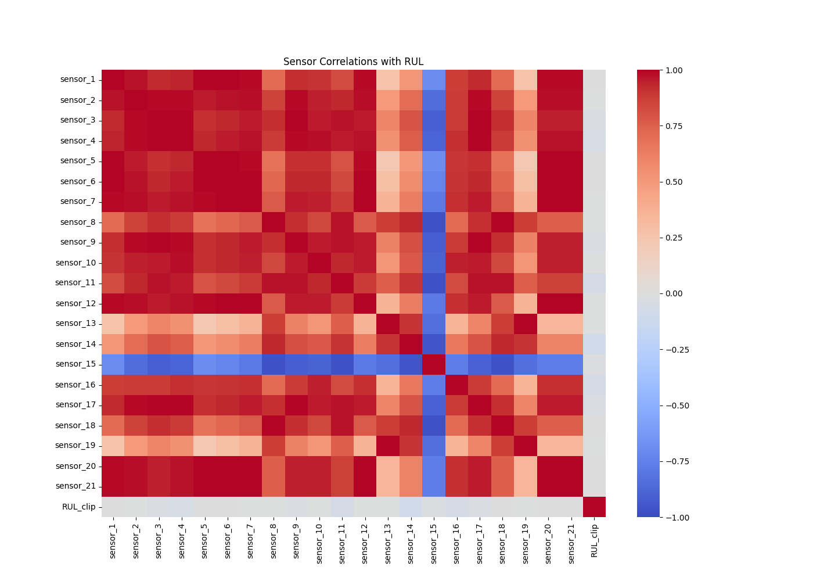
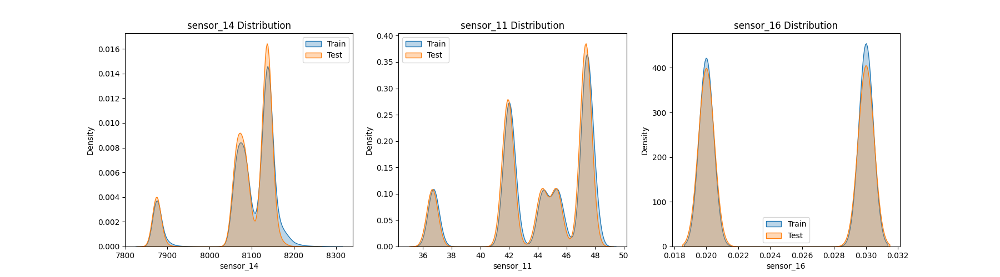

# Phase 3 EDA Report
**Date:** 2026-02-24 19:37:11

### Train Dataset
- **Shape:** (160359, 31)
- **Engines:** 709
- **Avg Cycles/Engine:** 226.2
- **Max Cycles:** 543
- **Missing Values:** 0

### Test Dataset
- **Shape:** (104897, 32)
- **Engines:** 707
- **Avg Cycles/Engine:** 148.4
- **Max Cycles:** 486
- **Missing Values:** 0

### Data Quality Checks
- **Constant/Near-Constant Sensors (std < 0.01):** sensor_16

### Feature Drift Analysis
