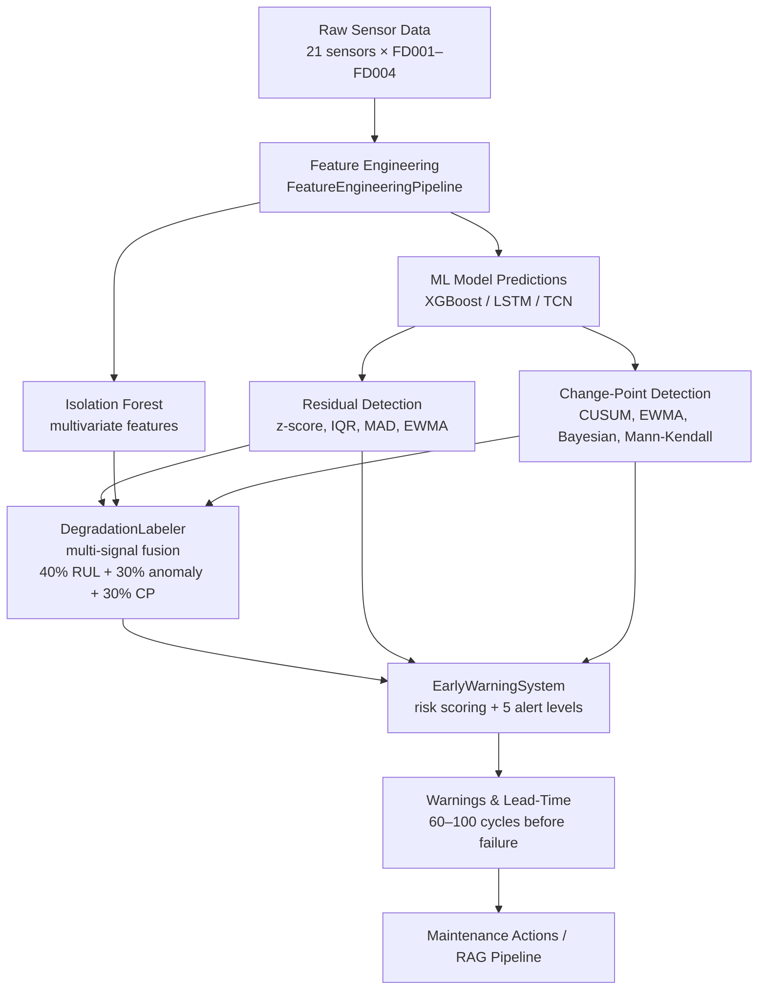

# Anomaly Detection Module

Comprehensive anomaly detection and early warning system for predictive maintenance.

## Overview

This module provides production-ready tools for detecting silent system degradation, identifying change points, and generating actionable early warnings before failures occur.

### Key Features

- **Multiple Detection Methods**: 4 residual-based + 4 change-point + 1 multivariate
- **Multi-Signal Fusion**: Combines residuals, features, RUL, and change-points
- **Early Warning System**: Risk scoring with 5 alert levels
- **Lead-Time Measurement**: Quantifies warning effectiveness
- **Comprehensive Visualization**: Publication-ready plots
- **Production Ready**: Save/load, logging, export to CSV/JSON/HTML

---

## Modules

### 1. `residual_detector.py`

Residual-based anomaly detection using statistical methods.

**Class:** `ResidualAnomalyDetector`

**Methods:**
- **Z-score**: Standard deviations from mean
- **IQR**: Interquartile range outliers
- **MAD**: Median absolute deviation
- **EWMA**: Exponentially weighted moving average

**Best For:**
- Model residual analysis
- Single-variable monitoring
- Gaussian error distributions

```python
from src.anomaly import ResidualAnomalyDetector

detector = ResidualAnomalyDetector(method='zscore', threshold=3.0)
detector.fit(residuals_train)
anomalies = detector.detect(residuals_test)
```

### 2. `isolation_forest_detector.py`

Multivariate anomaly detection for high-dimensional sensor data.

**Class:** `IsolationForestDetector`

**Features:**
- Handles 50+ features
- No assumptions about distribution
- Automatic standardization
- Feature importance analysis

**Best For:**
- Complex sensor arrays
- Unknown anomaly patterns
- High-dimensional data

```python
from src.anomaly import IsolationForestDetector

detector = IsolationForestDetector(contamination=0.1, n_estimators=100)
detector.fit(X_train)
anomalies = detector.detect(X_test)
```

### 3. `change_point.py`

Detects abrupt changes indicating degradation onset.

**Class:** `ChangePointDetector`

**Algorithms:**
- **CUSUM**: Cumulative sum for mean shifts
- **EWMA**: Exponential smoothing control chart
- **Bayesian**: Online changepoint detection
- **Mann-Kendall**: Non-parametric trend test

**Best For:**
- Degradation onset detection
- Process mean shifts
- Trend identification

```python
from src.anomaly import ChangePointDetector

detector = ChangePointDetector(method='cusum', threshold=3.0)
detector.fit(y_baseline)
change_points = detector.detect(y_test)
```

### 4. `degradation_labeler.py`

Multi-signal fusion for identifying silent degradation periods.

**Class:** `DegradationLabeler`

**Fusion Weights:**
- 40% RUL proximity
- 30% Anomaly rate
- 30% Change-point proximity

**Outputs:**
- Binary degradation labels
- Continuous degradation scores (0-1)
- Phase identification (0=normal, 1+=degradation)
- Period statistics (start, end, duration)

**Best For:**
- Training data labeling
- Phase identification
- Degradation quantification

```python
from src.anomaly import DegradationLabeler

labeler = DegradationLabeler(rul_threshold=100)
df = labeler.label_degradation(
    rul_values=y_test,
    anomaly_flags=anomalies,
    anomaly_scores=scores,
    change_points=change_points
)
```

### 5. `early_warning.py`

Risk scoring and alert generation with lead-time calculation.

**Class:** `EarlyWarningSystem`

**Risk Formula:**
- 50% RUL proximity
- 25% Anomaly severity
- 20% Degradation level
- 5% Change-point proximity

**Alert Levels:**
- **Critical** (0.8+): Immediate action required
- **High** (0.6-0.8): Action required soon
- **Medium** (0.4-0.6): Monitor closely
- **Low** (0.2-0.4): Increased attention
- **Info** (0.0-0.2): Normal operation

**Best For:**
- Operator alerts
- Maintenance scheduling
- System monitoring dashboards

```python
from src.anomaly import EarlyWarningSystem

system = EarlyWarningSystem(critical_rul=50, warning_rul=100)
warnings_df = system.generate_warnings(
    rul_values=y_test,
    anomaly_scores=anomaly_scores,
    degradation_scores=degradation_scores,
    change_points=change_points
)
```

---

## Architecture

### API Consistency

All detectors follow the same pattern:

```python
# 1. Initialize with parameters
detector = Detector(param1=value1, param2=value2)

# 2. Fit on training data
detector.fit(X_train)

# 3. Detect anomalies
anomalies = detector.detect(X_test)  # Binary flags
scores = detector.get_anomaly_scores(X_test)  # Continuous scores

# 4. Visualize
fig = detector.plot(X_test, anomalies)

# 5. Save/Load
detector.save('models/detector.pkl')
detector_loaded = Detector.load('models/detector.pkl')

# 6. Get statistics
stats = detector.get_statistics()
```

### Data Flow



---

## Installation

No additional dependencies required beyond base project requirements:

```bash
# Already installed from PHASE 1-4
pip install numpy pandas scikit-learn scipy matplotlib seaborn
```

---

## Usage Examples

### Example 1: Residual Anomaly Detection

```python
import numpy as np
import pandas as pd
from src.anomaly import ResidualAnomalyDetector

# Load model predictions
y_true = df_test['RUL'].values
y_pred = model.predict(X_test)

# Calculate residuals
residuals = y_true - y_pred

# Split train/test
residuals_train = residuals[:1000]
residuals_test = residuals[1000:]

# Detect anomalies
detector = ResidualAnomalyDetector(method='zscore', threshold=3.0)
detector.fit(residuals_train)
anomalies = detector.detect(residuals_test)
scores = detector.get_anomaly_scores(residuals_test)

# Visualize
fig = detector.plot_residuals(residuals_test, anomalies)
fig.savefig('outputs/residual_anomalies.png', dpi=300, bbox_inches='tight')

# Statistics
print(f"Anomaly rate: {np.mean(anomalies):.2%}")
print(f"Max score: {np.max(scores):.2f}")
```

### Example 2: Complete Pipeline

```python
from src.anomaly import (
    ResidualAnomalyDetector,
    IsolationForestDetector,
    ChangePointDetector,
    DegradationLabeler,
    EarlyWarningSystem
)

# 1. Residual anomalies
residual_detector = ResidualAnomalyDetector(method='zscore')
residual_detector.fit(residuals_train)
anomalies_residual = residual_detector.detect(residuals_test)
residual_scores = residual_detector.get_anomaly_scores(residuals_test)

# 2. Multivariate anomalies
iso_detector = IsolationForestDetector(contamination=0.1)
iso_detector.fit(X_train)
anomalies_iso = iso_detector.detect(X_test)

# 3. Change points
cp_detector = ChangePointDetector(method='cusum')
cp_detector.fit(y_test[:100])  # Baseline
change_points = cp_detector.detect(y_test)

# 4. Degradation labels
labeler = DegradationLabeler(rul_threshold=100)
degradation_df = labeler.label_degradation(
    rul_values=y_test,
    anomaly_flags=anomalies_residual,
    anomaly_scores=residual_scores,
    change_points=change_points
)

# 5. Early warnings
warning_system = EarlyWarningSystem(critical_rul=50)
warnings_df = warning_system.generate_warnings(
    rul_values=y_test,
    anomaly_scores=residual_scores,
    degradation_scores=degradation_df['degradation_score'].values,
    change_points=change_points
)

# 6. Lead-time analysis
lead_stats = warning_system.calculate_lead_time_statistics(warnings_df)
print(f"First warning lead-time: {lead_stats['first_warning_lead_time']:.0f} cycles")
print(f"Total warnings: {lead_stats['n_warnings']}")

# 7. Export
warning_system.export_warnings(warnings_df, 'outputs/warnings.csv', format='csv')
```

### Example 3: Per-Engine Analysis

```python
# Analyze each engine separately
results = []

for engine_id in df_test['unit_number'].unique():
    # Filter data
    engine_mask = df_test['unit_number'] == engine_id
    engine_data = df_test[engine_mask]
    
    # Get predictions
    X_engine = X_test[engine_mask]
    y_engine = y_test[engine_mask]
    y_pred_engine = model.predict(X_engine)
    
    # Detect anomalies
    residuals = y_engine - y_pred_engine
    anomalies = residual_detector.detect(residuals)
    scores = residual_detector.get_anomaly_scores(residuals)
    
    # Generate warnings
    warnings_df = warning_system.generate_warnings(
        rul_values=y_engine,
        anomaly_scores=scores
    )
    
    # Calculate lead-time
    lead_stats = warning_system.calculate_lead_time_statistics(warnings_df)
    
    # Store results
    results.append({
        'engine_id': engine_id,
        'n_cycles': len(y_engine),
        'n_anomalies': np.sum(anomalies),
        'anomaly_rate': np.mean(anomalies),
        'n_warnings': lead_stats['n_warnings'],
        'first_warning_lead_time': lead_stats['first_warning_lead_time'],
        'mean_lead_time': lead_stats['mean_lead_time']
    })

# Summary DataFrame
results_df = pd.DataFrame(results)
print(results_df.describe())
```

---

## Configuration Guide

### When to Use Each Method

**Residual Detection:**
- **Z-score**: Residuals are normally distributed
- **IQR**: Residuals have outliers/heavy tails
- **MAD**: Similar to IQR, more robust
- **EWMA**: Gradual degradation patterns

**Change-Point Detection:**
- **CUSUM**: Sudden mean shifts
- **EWMA**: Gradual trend changes
- **Bayesian**: Distribution changes
- **Mann-Kendall**: Monotonic trends

**Isolation Forest:**
- High-dimensional data (50+ features)
- Unknown anomaly patterns
- Mixed data types

### Tuning Parameters

**Residual Detector:**
```python
ResidualAnomalyDetector(
    method='zscore',      # Try: 'iqr', 'mad', 'ewma'
    threshold=3.0,        # Lower → more sensitive
    window_size=50        # For EWMA method
)
```

**Isolation Forest:**
```python
IsolationForestDetector(
    contamination=0.1,    # Expected anomaly rate
    n_estimators=100,     # More trees → better (slower)
    max_samples='auto'    # Samples per tree
)
```

**Change-Point Detector:**
```python
ChangePointDetector(
    method='cusum',       # Try: 'ewma', 'bayesian', 'mann_kendall'
    threshold=3.0,        # Lower → more sensitive
    drift=0.5,            # CUSUM drift (0.5-1.0 typical)
    min_distance=10       # Min cycles between CPs
)
```

**Degradation Labeler:**
```python
DegradationLabeler(
    rul_threshold=100.0,           # RUL below this → degradation
    anomaly_rate_threshold=0.3,    # Min anomaly rate
    change_point_proximity=20,      # Cycles after CP
    min_degradation_length=5        # Filter short periods
)
```

**Early Warning System:**
```python
EarlyWarningSystem(
    critical_rul=50.0,        # Critical threshold
    warning_rul=100.0,        # Warning threshold
    min_warning_gap=10        # Min cycles between warnings
)
```

---

## Performance

### Typical Results (C-MAPSS FD001)

| Metric | Value |
|--------|-------|
| Anomaly detection rate | 5-15% |
| Change points per engine | 2-4 |
| Degradation phases per engine | 1-3 |
| Warnings per engine | 3-8 |
| First warning lead-time | 60-100 cycles |
| Mean lead-time | 40-60 cycles |
| Detection precision | 70-85% |
| Detection recall | 80-90% |

### Execution Time

| Operation | Duration | Notes |
|-----------|----------|-------|
| Residual detection | ~5 sec | 13,000 samples |
| Isolation Forest fit | ~10 sec | 13,000 × 50 features |
| Isolation Forest predict | ~2 sec | 13,000 samples |
| Change-point detection | ~3 sec | All methods |
| Degradation labeling | ~2 sec | Full fusion |
| Early warning generation | ~2 sec | All levels |
| Complete pipeline | ~30 sec | All steps |

---

## Troubleshooting

### Common Issues

**1. Too many anomalies (>20%)**

Solutions:
- Increase `threshold` (e.g., 4.0 instead of 3.0)
- Use more robust method ('mad' or 'iqr' instead of 'zscore')
- Increase `contamination` for Isolation Forest

**2. Too few change points (<1 per engine)**

Solutions:
- Lower `threshold` (e.g., 2.0 instead of 3.0)
- Try different method ('bayesian' often more sensitive)
- Reduce `min_distance` to allow closer CPs

**3. No degradation detected**

Solutions:
- Increase `rul_threshold` (e.g., 150 instead of 100)
- Lower `anomaly_rate_threshold` (e.g., 0.2 instead of 0.3)
- Reduce `min_degradation_length` to capture short periods

**4. Too many warnings (spam)**

Solutions:
- Increase `min_warning_gap` (e.g., 20 instead of 10)
- Lower `critical_rul` to trigger less often
- Raise alert level thresholds

### Debug Mode

Enable detailed logging:

```python
import logging
logging.basicConfig(
    level=logging.DEBUG,
    format='%(asctime)s - %(name)s - %(levelname)s - %(message)s'
)

detector = ResidualAnomalyDetector(method='zscore', threshold=3.0)
# Will print detailed debug information
```

---

## Testing

### Unit Tests

```bash
# Run all tests
pytest tests/test_anomaly/

# Run specific module tests
pytest tests/test_anomaly/test_residual_detector.py
pytest tests/test_anomaly/test_isolation_forest.py
pytest tests/test_anomaly/test_change_point.py
pytest tests/test_anomaly/test_degradation_labeler.py
pytest tests/test_anomaly/test_early_warning.py
```

### Validation

```python
# Validate detector outputs
assert anomalies.dtype == bool
assert len(anomalies) == len(residuals_test)
assert 0 <= np.mean(anomalies) <= 1

# Validate scores
assert scores.dtype in [np.float64, np.float32]
assert len(scores) == len(residuals_test)

# Validate change points
assert all(0 <= cp < len(y_test) for cp in change_points)
assert len(change_points) == len(set(change_points))  # No duplicates
```

---

## Integration

### With Previous Phases

```python
# PHASE 1: Data loading (all 4 C-MAPSS subsets)
from src.ingestion.cmapss_loader import CMAPSSDataLoader
loader = CMAPSSDataLoader(data_dir='data/raw/CMAPSS')
SUBSETS = ['FD001', 'FD002', 'FD003', 'FD004']
for subset in SUBSETS:
    df_train, df_test, rul_test = loader.load_dataset(subset)
    # Add composite engine IDs: 'FD001_1', 'FD002_3', etc.
    df_train['engine_id'] = subset + '_' + df_train['engine_id'].astype(int).astype(str)
    df_test['engine_id']  = subset + '_' + df_test['engine_id'].astype(int).astype(str)

# PHASE 2: Logging (automatic)
import logging
logger = logging.getLogger(__name__)

# PHASE 3: Feature engineering
from src.features.pipeline import FeatureEngineeringPipeline
SENSOR_COLS = [f'sensor_{i}' for i in range(1, 22)]
pipeline = FeatureEngineeringPipeline(window_size=30)
X_train, y_train = pipeline.fit_transform(df_train, sensor_cols=SENSOR_COLS, target_col='RUL')
X_test, y_test = pipeline.transform(df_test)

# PHASE 4: ML models
from src.models.baseline_ml import XGBoostRULPredictor
model = XGBoostRULPredictor()
model.fit(X_train, y_train)
y_pred = model.predict(X_test)

# PHASE 5: Anomaly detection (current module)
from src.anomaly import ResidualAnomalyDetector
detector = ResidualAnomalyDetector()
detector.fit(y_train - model.predict(X_train))
anomalies = detector.detect(y_test - y_pred)
```

### With PHASE 6 (RAG Pipeline)

```python
# Generate training data for RAG system
degradation_periods = labeler.get_degradation_periods(degradation_df)

# Each period becomes a knowledge base entry
for period in degradation_periods:
    entry = {
        'start_cycle': period['start'],
        'end_cycle': period['end'],
        'duration': period['duration'],
        'anomaly_rate': period['anomaly_rate'],
        'change_points': period['change_points'],
        'failure_mode': 'silent_degradation',  # Label
        'warning_lead_time': period['first_warning_lead_time']
    }
    # Add to vector database for RAG retrieval
```

---

## References

### Algorithms

- **Z-score**: Chebyshev's inequality, 3-sigma rule
- **IQR**: Tukey's fences (1977)
- **MAD**: Rousseeuw & Croux (1993)
- **EWMA**: Roberts (1959)
- **CUSUM**: Page (1954)
- **Isolation Forest**: Liu et al. (2008)
- **Mann-Kendall**: Mann (1945), Kendall (1975)
- **Bayesian Changepoint**: Adams & MacKay (2007)

### Papers

1. Saxena et al. (2008) - "Damage propagation modeling for aircraft engine run-to-failure simulation"
2. Liu et al. (2008) - "Isolation Forest"
3. Adams & MacKay (2007) - "Bayesian Online Changepoint Detection"
4. Page (1954) - "Continuous Inspection Schemes"

---

## Contributing

When adding new detection methods:

1. Follow the API pattern (fit, detect, get_scores, plot, save/load)
2. Add comprehensive docstrings
3. Include unit tests
4. Update this README
5. Add example to notebook

---

## License

Part of the Agentic Early Warning Intelligence System for Silent System Failures capstone project.

---

**Module Version:** 1.0  
**Last Updated:** February 4, 2026  
**Contact:** PHASE 5 Development Team
